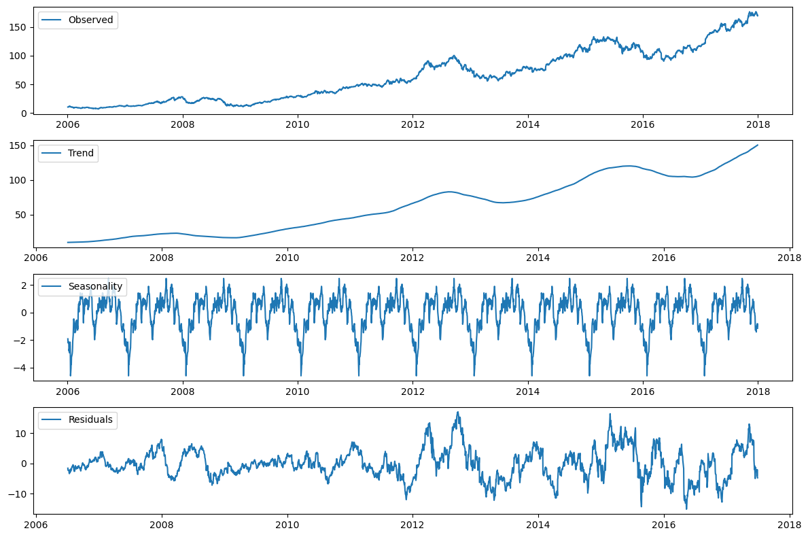
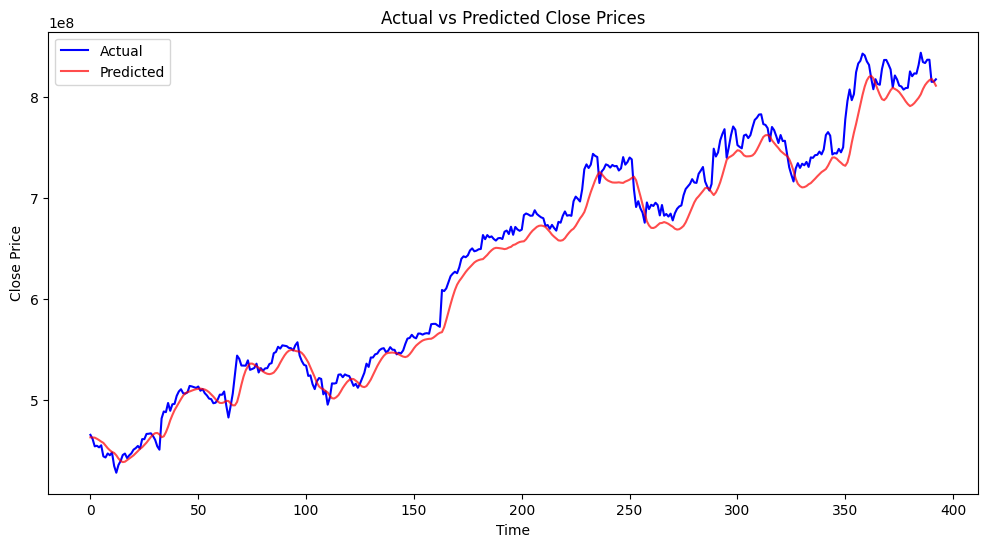

# Forecasting The Stock Prices For AAPL Stocks
 
This project aims to forcast the stick price in a sequencial dataset.

Weekly submission will be made to indicate the progress if the project.

-Find the weekly updates on codes in the Week_Sub_Files Update

**Introduction**

The task of forecasting stock prices for Apple Inc. (AAPL) using historical data from 2006 to 2018 involves applying statistical and machine learning techniques to predict future price movements based on past trends. This analysis seeks to identify patterns, correlations, and trends within the stock's historical price data, including factors such as daily closing prices, trading volume, and market behavior. By leveraging advanced forecasting models—such as time series analysis, regression models, and neural networks—the goal is to develop a reliable predictive framework that can inform investment strategies, risk management, and decision-making in the stock market. In this study, we employ three machine learning models Recurrent Neural Networks (RNNs), Long Short-Term Memory networks (LSTMs), and the Autoformer model as they represent key advancements in time-series forecasting and sequential data modeling. We explain a bit of these methods in the literature review section [2]

**Team Members**

Bright Wiredu Nuakoh   
Olivier Kanamugire  
Durbar Hore Partha

# Data Description

Find data here <a href="https://www.marketwatch.com/investing/stock/aapl/downloaddatapartial?startdate=11/20/2024%2000:00:00&enddate=12/20/2024%2023:59:59&daterange=d30&frequency=p1d&csvdownload=true&downloadpartial=false&newdates=false">Click Me</a> 

Find more details here/.....
**SOME RESULTS**
The following are some results obtained from the implemented models

**Baseline Models**
AR Prediction 

**RNN Results**

**LSTM Result**

**AUtoformer Result**

